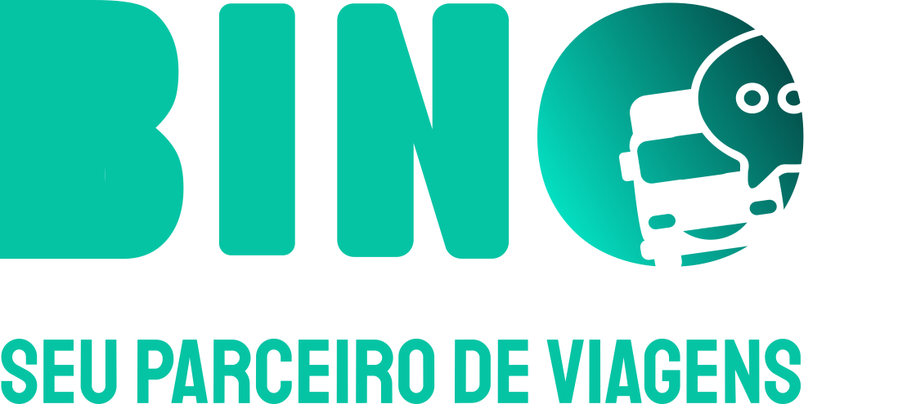
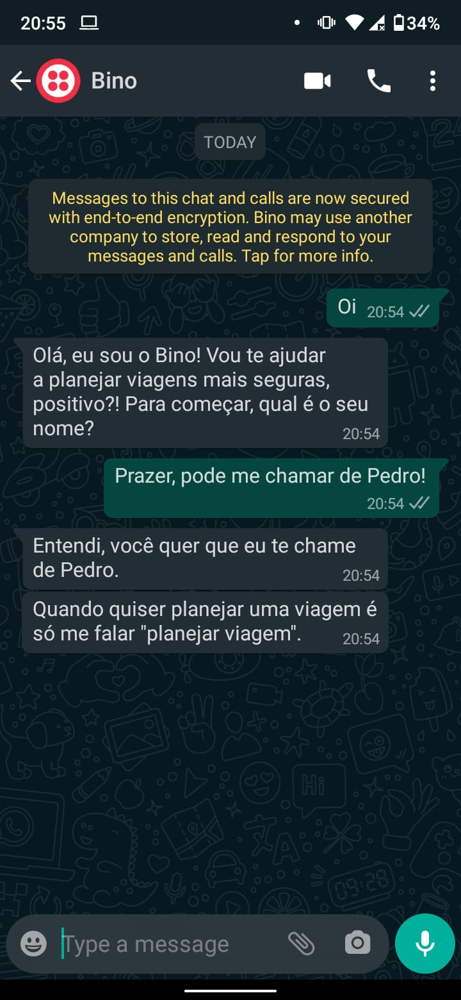
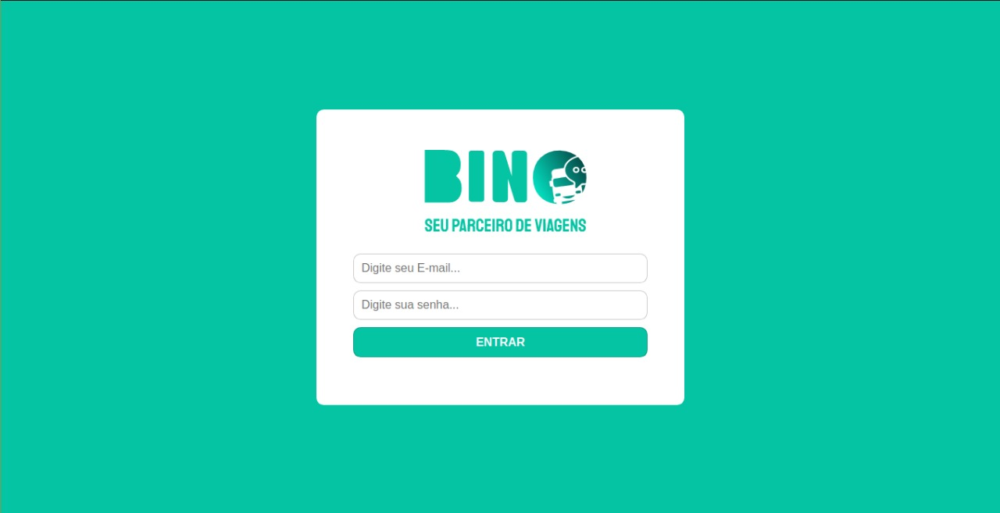

<h1 align="center">
    
</h1>

# BinoBot
O Bino ajuda caminhoneiros a planejarem suas viagens para que elas sejam seguras e livres de imprevistos.

Projeto construído durante a [HACKATHON CCR](http://www.grupoccr.com.br/hackathonccr/), organizada pela [Shawee](https://shawee.io).

  

  
	
  

  

  

  
  

<h2 align='center'>
      
</h2>
<h2 align='center'>
      
</h2>  

Olá, eu sou o BinoBot e vou ajudar você, meu parceiro, a planejar suas viagens para que elas sejam seguras e livres de imprevistos. Juntos podemos traçar a sua rota identificando pontos de parada seguros. Além disso, você poderá optar por reservar estes locais e viajar ainda mais tranquilo.

Aconteceu alguma situação inesperada ou algo fora da lei? Não se preocupe, conte para mim o que aconteceu e eu vou te ajudar. Afinal, sou um parceiro para todas as horas.

    
## Show your support

Give a ⭐️ if this project helped you!

## :memo: License

This project is under the MIT license. See the [LICENSE](LICENSE.md) for details.

---

Made with ♥ by Fabio Papais :wave: [Get in touch!](mailto:fabiopapais@hotmail.com) and Welton Felix :wave: [Get in touch!](mailto:contato.weltonf@gmail.com)
